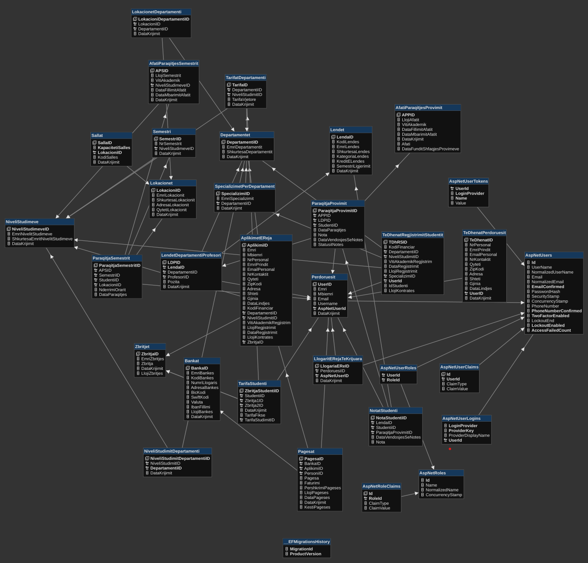
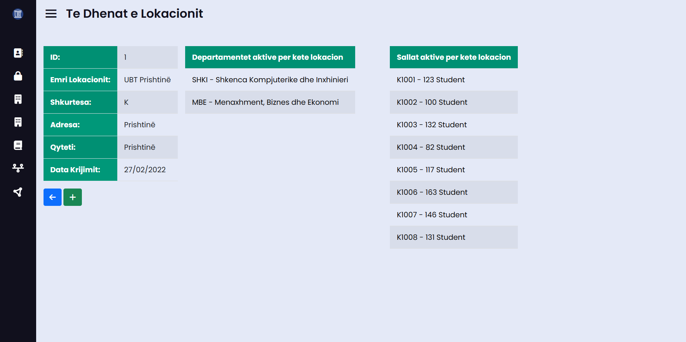

# SMIS-W23G37
# Rreth Projektit
Ky projekt eshte punuar per projektin ne **Hyrje në Ueb Programim** & **Zhvillimi dhe Dizajnimi i Ueb**.

Sistemi Permban keto Role:
- **Admin**
- **Puntor Administrate**
- **Financa**
- **Profesor**
- **Asistent**
- **Student**

Sistemi permban funksione te ndryshme si *Paraqitja e Transkriptes, Vertetimin Studentor, Pagesat e Studentit, Paraqitjen e Provimeve, Menaxhimin e Lendeve, Menaxhimin e Studenteve, Krijimin e llogarive, Menaxhimin e Departamenteve dhe Lokacioneve, Menaxhimin e Financave*, si dhe shume funksione te tjera te ndryshme te cilat tashme veqse jane tashme funksionale.

Ky projekt eshte i punuar ne
- **React JS** - Frontend
- **ASP.NET Core Web App (MVC)** - Backend & Fronetend
- **MSSQL** – Database

Eshte punuar nga:
- **Rilind Kyçyku** - 212257449 (rk57449@ubt-uni.net)
- **Valdrin Dalloshi** - 212261697 (vd616972@ubt-uni.net)
- **Ilire Jezerci** - 212260094 (ij60094@ubt-uni.net)

Profesoret:
- **Xhelal Jashari** - can. PhD.
- **Edmond Jajaga** - Assoc. Prof. Dr.

# Konfigurimi
Se pari duhet te behet konfigurimi i Connection String ne W23G37/appsettings.json dhe duhet te nderrohet emri i Server me ate te serverit tuaj, Emri i Databazes nuk preferohet te ndryshohet, pastaj ju duhet te beni run komanden **Update-Database** ne **Serverin e Projektit - W23G37** -> *Tools* > *NuGet Package Manager* > *Package Manager Console* e cili do te mundesoj gjenerimin ne teresi te databases dhe insertimin e te dhenave bazike gjithashtu mund te perdoret edhe nje SQL File i gatshem me te dhena te ndryshme si Departamente, Salla, Lokacione ejt. Ky file gjendet tek *Databaza > W23G37Databaza.sql*, pasi te keni perfunduar me keto hapa ju duhet qe te beni run serverin dhe pastaj ne VSC pjesen e React qe gjendet tek **w23g37web** duhet te hapet ne terminal pastaj duhen te behen run keto komonda:

*Keto duhen te behen vetem ne qoftese e keni hapur projketin per here te pare*

**npm i** - Bene instalimin automatik te paketave te nevojtura,

**npm run build** - Bene Build Projektin,

*Kjo duhet te behet gjithmone kur startojme projektin e React*

**npm start** - Bene startimin e projektit.

  

## Te Dhenat per Kyqje
  
| **Email**  | **Password** | **Aksesi** |
|--|--| -- |
| admin@ubt-uni.net | Admin1@ | *Admin*| 
|financa.financa@ubt-uni.net | financafinanca1@|  *Financa*| 
| administrat.administrat@ubt-uni.net|  administratadministrat1@ | *Administrat*| 
| asistent.asistent@ubt-uni.net | asistentasistent1@|  *Asistent*| 
| profesor.profesor@ubt-uni.net|  profesorprofesor1@|  *Profesor* | 
| ss00002@ubt-uni.net| ss00002@ubt-uni.net | *Student* | 

# Diagrami Databazes

# Pamja e SMIS

## Pamja MVC

### AdminDashboardMVC

### CreateViewMVC

### DeleteViewMVC

### DetailsViewMVC

### IndexViewMVC

### UpdateViewMVC

## Pamja React JS

### CreateViewReact

### DeleteViewReact

### IndexViewReact

### ParaqitProvimetView

### StafiDashboard

### StudentiDashboard

### UpdateViewReact

### VendosNotatView

## Dokumete te Cilat Gjenerohen

### Kartela Analitike

### Te Dhenat E Aplikimit

### Transkripta e Notes

